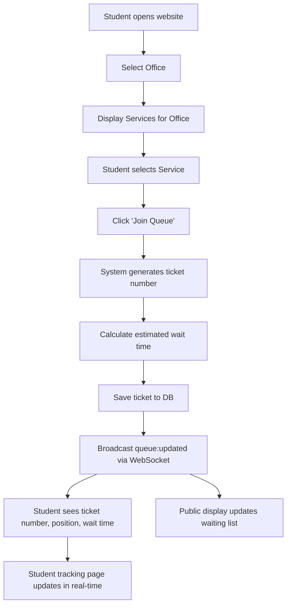
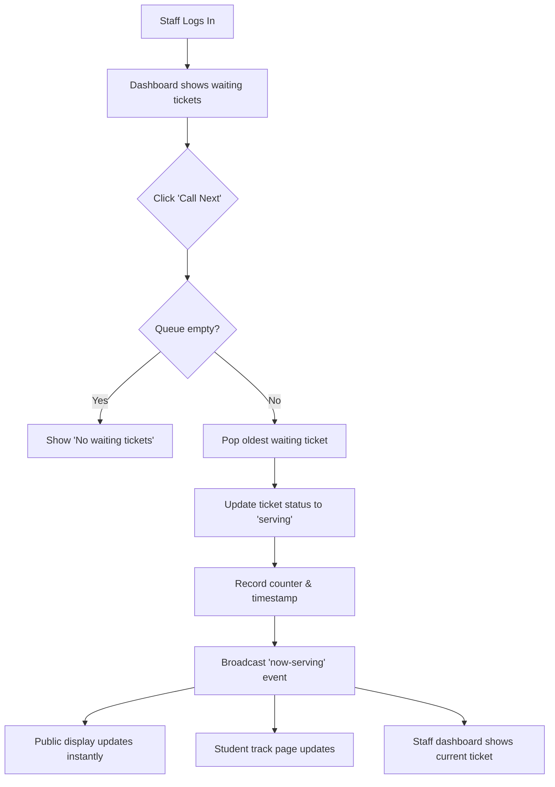
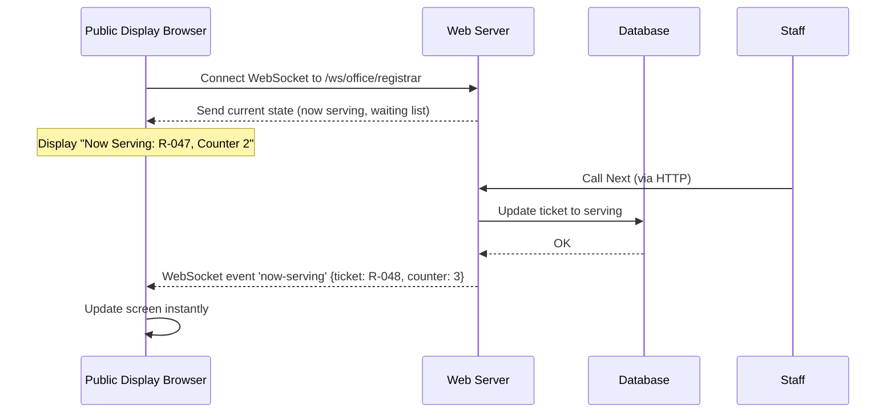

# Workflow Diagram Document for Queue Management System

## 1. Overview
This document contains the key process flows of the queue management system. Each workflow is described in plain text and can be turned into a visual diagram using Mermaid (code-based), draw.io (drag-and-drop), or even hand-drawn sketches. The workflows cover:

* Student joining the queue

* Staff calling the next ticket

* Staff completing a ticket

* Administrator configuring the system

* Real-time update flow for public display

---
## 2. Workflow 1: Student Joins a Queue (US-01, US-02, US-03)

Step-by-step description:

1. Student visits the website (e.g., queuesystem.school.edu).

2. The system shows a list of active offices (Registrar, Cashier, …).

3. Student selects an office.

4. The system fetches and displays the services available for that office.

5. Student selects a service (e.g., “Transcript Request”).

6. Student clicks “Join Queue”.

7. System generates a unique ticket number (e.g., R-047).

8. System calculates the estimated waiting time based on:

    * Number of people already waiting for that service

    * Average service duration for that service type

9. System saves the new ticket to the database with status = waiting.

10. System broadcasts a queue:updated event (WebSocket) to all connected clients (public display, admin dashboard, etc.).

11. The student’s browser receives:

    * Ticket number

    * Position in queue

    * Estimated wait time

12. The student can now see a tracking page that shows their status and updates in real time.

13. Optionally, browser notification permission is prompted; when the student is next in line, a notification is triggered.
---



---

## 3. Workflow 2: Staff Calls Next Ticket (US-04, US-05)

Step-by-step description:

1. Staff member opens the staff dashboard URL and logs in.

2. System authenticates and identifies the staff’s assigned counter and office.

3. Dashboard shows the queue of waiting tickets for that counter’s service(s).

4. Staff clicks the “Call Next” button.

5. System checks if there is at least one ticket with status waiting in the relevant queue.

6. If queue is empty, display “No waiting tickets” and stop.

7. If tickets exist, system takes the oldest waiting ticket (FIFO).

8. System updates the ticket status to serving, sets counter_id and called_at timestamp.

9. System broadcasts a now-serving event containing: ticket number, counter number/label, and service name.

10. The public display and student tracking pages update immediately (via WebSocket listeners).

11. The staff dashboard updates:

    * The “Call Next” button becomes enabled again for next call.

    * The current serving ticket is displayed prominently.


---

## 4. Workflow 3: Staff Completes a Ticket (US-06)

Step-by-step description:

1. After serving the student, the staff member clicks “Done” (or “No-show” if the student didn’t appear).

2. System changes the ticket status to completed (or no_show).

3. System sets completed_at timestamp.

4. System broadcasts a ticket:completed event (with ticket number and new status).

5. The counter becomes free; the staff dashboard removes the current serving ticket and re-enables the call button if there are more waiting tickets.

6. Public display and any tracking pages update to remove the ticket from “Now Serving”.

7. Admin statistics are updated (in real-time or aggregated).

```mermaid
flowchart TD
    A[Staff clicks 'Done' or 'No-show'] --> B[Update ticket status to completed/no-show]
    B --> C[Set completed_at timestamp]
    C --> D[Broadcast 'ticket:completed' event]
    D --> E[Public display clears 'Now Serving']
    D --> F[Student tracking page (if open) sees status change]
    D --> G[Staff dashboard becomes ready for next]
    D --> H[Admin dashboard reflects new completed count]
```
---
## 5. Workflow 4: Admin Configures Offices & Services (US-07)

Step-by-step description:

1. Admin logs into the admin panel.

2. Navigates to “Office Management”.

3. Can add a new office (name, description) or edit/delete existing ones.

4. Can add services to an office (name, estimated_minutes).

5. Can create counters (label, assign staff user, assign to office).

6. Each change is saved to the database.

7. The changes are reflected immediately for students joining (next page load) and for staff dashboards (after refresh or real-time update if implemented).

```mermaid
flowchart TD
    A[Admin logs into Admin Panel] --> B[Select 'Office Management']
    B --> C{Action?}
    C --> D[Add/Edit Office]
    C --> E[Add/Edit Service (linked to office)]
    C --> F[Create/Edit Counter (assign staff)]
    D --> G[Save to database]
    E --> G
    F --> G
    G --> H[Changes available to student join page & staff dashboards]
```
---

## 6. Workflow 5: Real‑time Public Display Update (US-10)

This shows the mechanism that keeps the public view fresh.

Step-by-step description:

1. A browser opens the display URL (e.g., /display/registrar).

2. On page load, it establishes a WebSocket connection (or long-polling fallback) to the server.

3. The page subscribes to the channel for that office (e.g., office:registrar).

4. The server sends the current state: current serving ticket, last few called tickets, and the waiting queue list.

5. Whenever a staff member calls next (now-serving event) or completes a ticket (ticket:completed), the server pushes the update to all subscribers of that office.

6. The display page listens for these events and updates the DOM without a full page refresh.

7. If the connection drops, it retries automatically and re-fetches the state.

